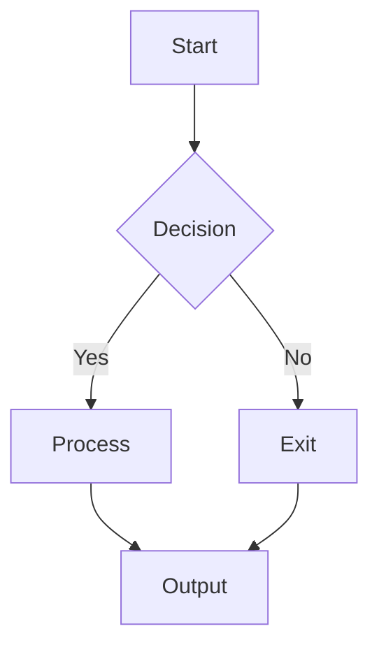
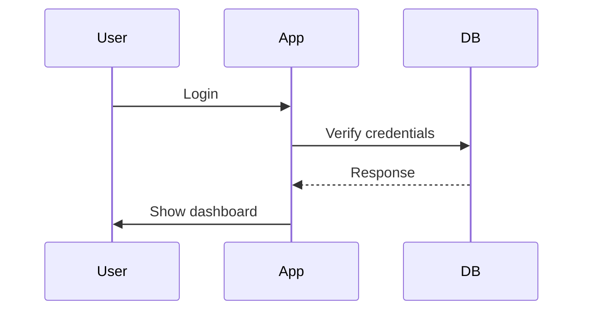

# Professional Markdown Reader Demo

Welcome to the **Professional Markdown Reader**! This application demonstrates advanced features for reading and viewing markdown files.

## Features Included

- ✅ Glassmorphism UI design
- ✅ Mermaid diagram support 
- ✅ Dynamic background themes
- ✅ Dark/light theme toggle
- 🔍 Fullscreen view for diagrams
- 💾 Export diagrams as images (conceptual)

## Example Mermaid Diagrams

Here's a simple flowchart:

And here's a sequence diagram:

## Getting Started

To use this application:

1. Open the app
2. Click "Open Markdown File" 
3. Select a markdown file
4. View rendered content with Mermaid diagrams
5. Use the controls to:
   - Change background theme hue
   - Toggle dark/light mode
   - View diagrams in fullscreen
   - Export diagrams (conceptual)

## Customization

The application supports:

- **Dynamic Backgrounds**: Adjust the color theme using the hue slider
- **Dark Mode**: Toggle between light and dark themes
- **Mermaid Support**: Automatically renders flowcharts, sequence diagrams, etc.